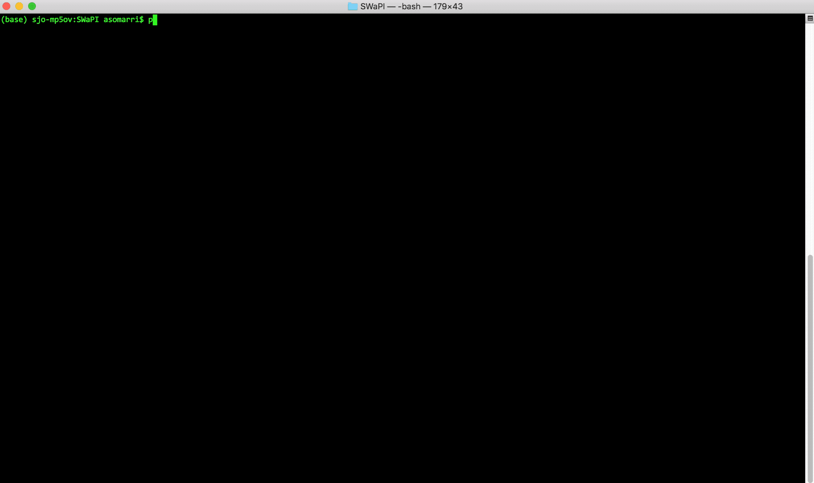

# SWaPI - DevOps TakeOver

### a.k.a. whiteRabbit

SWaPI takes Akamai's APIs to another level. Focusing in Automation & Data Output readability, whiteRabbit will BOOST your productivity!
&nbsp;

SWaPI supports the following Akamai OPEN APIs:

	1. Property Manager (PAPI)
	2. Application Security (APPSEC)
	3. Network Lists (NL)
	4. SIEM
	5. Identity Access Management (IAM)
	6. SiteShield (SS)
	7. Diagnostics (crawl/checkip)
	8. SPS and CPS
	9. Contracts
	10. Case Management
	11. Fast DNS
	11. PLX
	12. Alerts

## ALL IN ONE!!!
&nbsp;

# Installation

## Pre-Requisites

### XCode:

	xcode-select --install
&nbsp;

### PIP

Make sure **pip** is installed:

	$ pip -V

If pip is not installed, install it:

	$ sudo easy_install pip
&nbsp;
## Automatic Install

SWaPI should AUTO-INSTALL itself. Yes, you heard that well!

Requirements file should get auto-generated when running SWaPI for the 1st time. In the future, I might need to update this and install new libraries for proper operation.

&nbsp;
## Manual Installation

If you still want to do this process manually, or having any issues, use pip to install all of the following libraries (as a recommendation, use the '--user' flag when installing each library):

	nose==1.3.7
	xlrd==1.2.0
	pandas==0.24.2
	requests==2.18.4
	texttable==0.8.7
	pyopenssl==17.2.0
	dnspython==1.15.0
	Pygments==2.2.0
	paramiko==2.3.1
	edgegrid-python==1.0.10
	XlsxWriter==1.1.1
	beautifulsoup4==4.6.0
	pyfiglet==0.8.post1

&nbsp;

# Issues and Troubleshooting

#### pyOPENSSL
> ImportError: 'pyOpenSSL' module missing required functionality. Try upgrading to v0.14 or newer.

	pip install --upgrade --user pyOpenSSL

&nbsp;

#### Six
> Issue with six...unable to reproduce

	pip install --user six

&nbsp;
# Download SWaPI (latest v3.1.x)

Clone GIT:

	$ git clone git@github.com:akamai-contrib/swapi.git

&nbsp;
# Credentials

SWaPI uses the standard Akamai OPEN credentials file, .edgerc. By default, it will look for credentials in your HOME directory.
You can override which section to use with the '--section' option, which can be sent on each SWaPI command.
To set up your credential file, see the [Authorization](https://developer.akamai.com/legacy/introduction/Prov_Creds.html) and [credentials](https://developer.akamai.com/legacy/introduction/Conf_Client.html) sections of the [Get Started](https://developer.akamai.com/legacy/introduction/) guide.

&nbsp;
# Help

Having issues? Want to comment about it? Feel free to let me know!!!

&nbsp;

	python swapi.py --version
	python swapi.py --help
	python swapi.py help
	python swapi.py modules
	python swapi.py whiteRabbit

&nbsp;
# Caveats

Please report them!!
